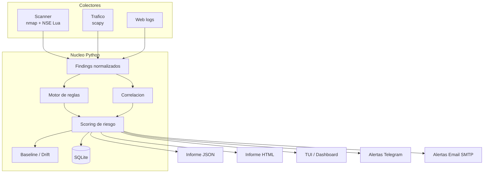
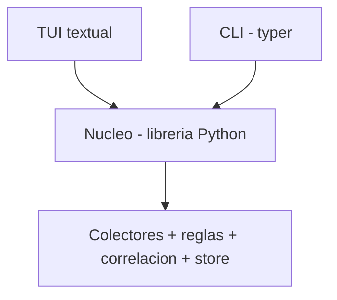

# LuaNetSentinel

**Auditor y mini-IDS de red defensivo, para línea de comandos.**

> Herramienta propia que analiza una red autorizada, detecta exposición y patrones sospechosos, asigna riesgo y genera informes — pensada para correr en un cyberdeck portátil y, a la vez, servir como proyecto enseñable (portfolio / posible TFG de ASIR).

---

## Tabla de contenidos

1. [Visión y objetivos](#1-visión-y-objetivos)
2. [Ámbito, uso ético y legal](#2-ámbito-uso-ético-y-legal)
3. [Plataformas soportadas](#3-plataformas-soportadas)
4. [Decisión de stack y por qué](#4-decisión-de-stack-y-por-qué)
5. [Arquitectura general](#5-arquitectura-general)
6. [Modelo de datos: Finding](#6-modelo-de-datos-finding)
7. [Motor de reglas](#7-motor-de-reglas)
8. [Scoring y correlación](#8-scoring-y-correlación)
9. [Baseline y drift](#9-baseline-y-drift)
10. [Persistencia](#10-persistencia)
11. [Colectores](#11-colectores)
12. [Alertas](#12-alertas)
13. [Modo watch (vigilancia en vivo)](#13-modo-watch-vigilancia-en-vivo)
14. [Informes y exportadores](#14-informes-y-exportadores)
15. [Interfaz TUI (textual)](#15-interfaz-tui-textual)
16. [CLI](#16-cli)
17. [Configuración](#17-configuración)
18. [Estructura del repositorio](#18-estructura-del-repositorio)
19. [Roadmap por fases](#19-roadmap-por-fases)
20. [Calidad e ingeniería](#20-calidad-e-ingeniería)
21. [Dependencias](#21-dependencias)
22. [Laboratorio de pruebas](#22-laboratorio-de-pruebas)
23. [Riesgos y casos límite](#23-riesgos-y-casos-límite)
24. [Definición de "hecho"](#24-definición-de-hecho)
25. [Notas para defensa de TFG](#25-notas-para-defensa-de-tfg)

---

## 1. Visión y objetivos

LuaNetSentinel es una **plataforma defensiva**: tres colectores que recogen información de una red autorizada, un núcleo común que normaliza los hallazgos en un modelo único (*Findings*), les asigna riesgo y los correlaciona, y varias salidas (informe JSON/HTML, dashboard de terminal, alertas).

La idea central que diferencia el proyecto de "tres scripts sueltos":

> **Tres colectores → un cerebro → un informe.**

Objetivos:

- **Defensivo de principio a fin**: escaneo autorizado, detección de exposición, hardening, análisis de tráfico y de logs, reporting. Nada ofensivo.
- **Herramienta real**, no demo: instalable, scriptable, usable a diario en el cyberdeck.
- **Enseñable**: portfolio en GitHub y posible Proyecto de Fin de Grado de ASIR, con documentación, tests, CI y demo.

---

## 2. Ámbito, uso ético y legal

LuaNetSentinel está diseñado **exclusivamente para uso autorizado**: redes propias o redes para las que se tiene permiso explícito por escrito.

Mecanismos que lo hacen cumplir y lo dejan claro:

- **Scope guard**: el motor sólo actúa sobre los rangos/objetivos declarados en el perfil de scope activo. Cualquier objetivo fuera de los CIDR autorizados se **rechaza o avisa** antes de lanzar nada.
- **Perfiles de scope**: `home`, `cliente-X (autorizado)`, `lab`, etc., para no mezclar contextos.
- **Banner de consentimiento** en el primer uso y al lanzar escaneos.
- **Registro de auditoría** (audit log): qué se escaneó, contra qué objetivo y cuándo.
- **Aviso legal** en el README y en la TUI: la herramienta no debe usarse contra infraestructura ajena sin autorización.

Es un punto fuerte de cara al TFG: demuestra criterio profesional y conocimiento del marco legal del pentesting/auditoría defensiva.

---

## 3. Plataformas soportadas

Se abandona Windows nativo. El objetivo es **Unix**: Linux, macOS y WSL2 (que es Linux).

| Plataforma | Escaneo + parseo | Análisis pcap (offline) | Captura en vivo | Auditoría de logs | TUI | Lab Docker/OpenResty |
|---|---|---|---|---|---|---|
| **Linux (Pi 5, cyberdeck)** | ✓ | ✓ | ✓ (NIC real) | ✓ | ✓ | ✓ |
| **macOS (desarrollo)** | ✓ | ✓ | ✓ (NIC real, requiere ChmodBPF) | ✓ | ✓ | ✓ (Docker Desktop) |
| **WSL2 (Windows)** | ✓ | ✓ | ⚠ sólo su red virtual (NAT) | ✓ | ✓ | ✓ |

> **Caveat WSL2**: por defecto WSL2 usa una NIC virtualizada con NAT, así que el sniffing en vivo **sólo ve el tráfico de su propia red, no la LAN del host Windows**. Esto no es un problema real: el monitoreo en vivo de verdad se hace en la Pi (el caso cyberdeck). WSL2 se usa para desarrollar y probar; el análisis offline de `.pcap` funciona igual en los tres sistemas.

---

## 4. Decisión de stack y por qué

**Python para el cerebro, Lua sólo donde es el lenguaje nativo de la herramienta (los scripts NSE de Nmap).**

| Opción | Veredicto | Motivo |
|---|---|---|
| Lua solo | ❌ | Distribución cross-platform débil (no hay intérprete único, módulos nativos necesitan compilador), librerías de TUI/HTML inmaduras. |
| Python solo | ⚠ | Lo más mantenible, pero tira el uso de Lua más auténtico y vendible: escribir un `.nse` propio = "extiendo una herramienta de seguridad profesional". |
| **Python + Lua (reparto)** | ✅ | Mejor distribución, mejor reporting, y conserva Lua donde de verdad importa. |

El reparto:

- **Python ≈ 90% (la plataforma)**: CLI, scope, orquestación (lanza `nmap`, captura tráfico), parseo, modelo de Finding, motor de reglas, correlación, scoring, baseline, historial+diff (SQLite), informes y TUI.
- **Lua (la extensión nativa)**: el script `suspicious-services.nse`, porque el motor de scripting de Nmap es Lua. Es la pieza que demuestra músculo técnico.

**Interfaz: `textual`** (no `rich` a secas). `rich` *renderiza* (tablas, paneles, colores); `textual` es el **framework de app TUI interactiva** construido sobre rich (navegación teclado/ratón, pantallas, formularios, widgets reactivos, live update). Para "una interfaz que maneje todas las opciones" y para impresionar en una defensa, `textual` es la elección. `rich` se usa por debajo para pintar y para la salida no interactiva (informes, JSON). Bonus: `textual serve` expone la TUI en navegador para demos.

---

## 5. Arquitectura general

### 5.1 Flujo de datos



### 5.2 Tres capas



El **núcleo es una librería**. Encima se montan dos front-ends que comparten exactamente la misma lógica:

- **CLI componible** (`lns scan`, `lns report`…): scriptable, ideal para cron en la Pi, pipes y CI.
- **TUI textual** (`lns` sin argumentos): interactiva y bonita.

La TUI nunca es la única puerta de entrada. Esto mantiene la automatización y facilita los tests.

---

## 6. Modelo de datos: Finding

El *Finding* es el contrato común que hablan los tres colectores. Una `dataclass` de Python.

| Campo | Tipo | Descripción |
|---|---|---|
| `id` | str | Identificador único del hallazgo |
| `rule_id` | str | Regla que lo generó |
| `source` | str | `scanner` \| `traffic` \| `weblog` |
| `severity` | str | `info` \| `low` \| `medium` \| `high` \| `critical` |
| `score` | int | 0–100 |
| `category` | str | `exposure`, `weak-config`, `suspicious-traffic`, `web-attack`, `tls`, … |
| `title` | str | Título corto |
| `description` | str | Explicación |
| `target` | dict | `{host, port, proto}` |
| `evidence` | dict | Datos de soporte, **siempre saneados** antes de exportar |
| `remediation` | str | Cómo mitigarlo |
| `ts` | float | Epoch |
| `run_id` | str | Ejecución a la que pertenece |

Ejemplo en JSON (formato canónico de exportación):

```json
{
  "id": "f_3a9c",
  "rule_id": "ssh-exposed",
  "source": "scanner",
  "severity": "medium",
  "score": 50,
  "category": "exposure",
  "title": "SSH expuesto",
  "description": "Puerto 22 abierto y accesible.",
  "target": { "host": "192.168.1.10", "port": 22, "proto": "tcp" },
  "evidence": { "banner": "OpenSSH 8.2", "state": "open" },
  "remediation": "Restringir por firewall/Tailscale; deshabilitar auth por password.",
  "ts": 1718600000.0,
  "run_id": "run_20260617_1830"
}
```

> El campo `evidence` se **sanea** (`util/sanitize.py`) antes de meterse en HTML o JSON: un banner o un dominio malicioso no debe romper ni inyectar el informe.

---

## 7. Motor de reglas

Las reglas son **plugins auto-descubiertos** desde `rules/{scanner,traffic,weblog}/`. Añadir una detección nueva = soltar un archivo, sin tocar los colectores.

Dos estilos, ambos soportados:

- **Programático**: función decorada que recibe un contexto y devuelve `bool` o `(bool, evidence)`.
- **Declarativo**: matchers de campos (`port`, `service`, `proto`, etc.).

```python
from lns.core.rules import rule
from lns.util.entropy import shannon

@rule(id="ssh-exposed", source="scanner",
      severity="medium", category="exposure",
      title="SSH expuesto",
      remediation="Restringe por firewall/Tailscale; deshabilita auth por password")
def ssh_exposed(ctx):
    return ctx.port == 22 and ctx.state == "open"

@rule(id="dns-tunneling", source="traffic",
      severity="high", category="suspicious-traffic",
      title="Posible DNS tunneling / DGA")
def dns_tunneling(ctx):
    if ctx.proto == "dns" and shannon(ctx.qname) > 3.8:
        return True, {"qname": ctx.qname, "entropy": round(shannon(ctx.qname), 2)}
    return False
```

**Harness de test**: `lns rules test` ejecuta una regla contra un *fixture* (XML de nmap, pcap o log de muestra) y comprueba que dispara lo esperado. Esto, en GitHub y en un TFG, demuestra madurez de ingeniería.

---

## 8. Scoring y correlación

### 8.1 Severidades

| Severidad | Banda de score | Score base |
|---|---|---|
| info | 0–9 | 5 |
| low | 10–39 | 25 |
| medium | 40–69 | 50 |
| high | 70–89 | 75 |
| critical | 90–100 | 95 |

### 8.2 Riesgo por host

```
riesgo_host = min(100, max(scores) + 0.25 * suma(scores_restantes))
```

Domina el hallazgo más grave, pero acumular varios medios sube el riesgo.

### 8.3 Correlación (lo que lo vuelve mini-IDS)

Si un mismo host/IP aparece en **dos o más fuentes distintas** (p. ej. SSH expuesto + DNS sospechoso saliente + intentos de ataque web), se aplica un **boost de +15** al riesgo del host (con tope 100). Esto convierte tres detectores independientes en una visión unificada de amenaza.

---

## 9. Baseline y drift

- **Baseline**: estado "bueno conocido" por host (puertos y servicios esperados), definido por el usuario.
- **Drift**: cualquier desviación respecto al baseline = finding (`category: drift`). Un puerto nuevo, un servicio que cambia de versión, un host que aparece.

Generaliza la idea de "diff entre el último escaneo y el anterior" a "**drift contra un estado de referencia**", que es práctica blue-team real (inventario de activos + detección de cambios) y muy relevante para ASIR.

Comandos: `lns baseline set`, `lns baseline show`, `lns baseline drift`.

---

## 10. Persistencia

**SQLite** (stdlib, cero dependencias, cross-platform). Almacena:

- `runs`: cada ejecución con su `run_id`, timestamp, scope y resumen.
- `findings`: todos los hallazgos, vinculados a su run.
- `baseline`: estado de referencia por host.

Permite: historial, comparador entre runs (`lns diff`), timeline de riesgo por host y detección de drift. El JSON canónico es la exportación; SQLite es la fuente de verdad interna.

---

## 11. Colectores

### 11.1 Scanner

- Lanza Nmap por subprocess: `nmap -oX - -sV <objetivo>` (+ `-sC` curado).
- Parsea el XML con `xml.etree.ElementTree` (stdlib, sin dependencias).
- Aplica las reglas de `rules/scanner/` → Findings.
- **Scope guard** antes de lanzar nada.
- **Script NSE propio en Lua** (`nse/suspicious-services.nse`): marca servicios legacy/inseguros (telnet, FTP, VNC, RDP expuestos, etc.).

```lua
-- nse/suspicious-services.nse (esqueleto)
description = "Marca servicios potencialmente inseguros para LuaNetSentinel"
categories  = {"safe", "discovery"}
author      = ">IZ:: / Glitchbane"
license     = "Same as Nmap"

local shortport = require "shortport"
local stdnse    = require "stdnse"

portrule = shortport.port_or_service(
  {21, 23, 3389, 5900},
  {"ftp", "telnet", "ms-wbt-server", "vnc"})

action = function(host, port)
  return stdnse.format_output(true, {
    note    = "Servicio potencialmente inseguro o legacy",
    service = port.service,
  })
end
```

**Mejoras opcionales (fases posteriores):**
- *TLS hygiene*: apoyarse en `ssl-enum-ciphers` y `ssl-cert` (NSE) → cifrados débiles, certificados caducados o autofirmados. No requiere internet.
- *Enriquecimiento CVE*: `vulners` (NSE) mapea versión → CVEs conocidos y mete el CVSS en el score. Requiere internet; con fallback offline.

### 11.2 Tráfico

- Basado en **scapy** (cross-platform; lee pcap siempre; sniff en vivo con libpcap/Npcap).
- Modos: `--pcap <archivo>` (offline, en los tres SO) y `--iface <if>` (en vivo; NIC real en Pi/mac, ver caveat WSL2).
- Detecciones:
  - **DNS**: entropía alta (DGA/tunneling), labels largos, ráfagas de NXDOMAIN, TXT anómalos.
  - **Credenciales en claro** sobre protocolos sin cifrar.
  - **TLS SNI** sospechosos.
  - **Beaconing**: conexiones periódicas al mismo host (posible C2).
  - **ARP spoofing**: anomalías ARP en la LAN (oro para un auditor LAN portátil).
- Cada hit → Finding.
- *Alternativa*: `pyshark` (envuelve tshark) si se quieren los dissectors de Wireshark; abre además la puerta a *taps* en Lua para tshark como módulo avanzado.

### 11.3 Web logs

- Parsea logs combinados de Nginx / Apache / Caddy (cross-platform, sólo lectura de ficheros).
- Firmas de ataque: SQLi, XSS, path traversal, user-agents de escáneres.
- Anomalías: tasa por IP, picos de 4xx/5xx.
- Cada hit → Finding. La misma IP que aparezca también en scanner/tráfico escala vía correlación.

---

## 12. Alertas

Sin n8n. Dos canales directos:

- **Telegram (Bot API)**: vía `requests` a la API de Telegram. Config: `bot_token` + `chat_id`. Envía findings por encima de un umbral de severidad.
- **Email (SMTP)**: vía `smtplib` + `email` (stdlib). Config: `host`, `port`, `user`, `password`, `from`, `to`. Envía informe o digest.

Control:
- **Umbral configurable** (p. ej. alertar sólo en `high` y `critical`).
- **Anti-spam**: agrupación/digest y rate-limiting para no inundar.
- Secretos por variables de entorno / `.env`, **nunca** commiteados.

---

## 13. Modo watch (vigilancia en vivo)

`lns watch` lanza un bucle que escanea y/o sniffa periódicamente, actualiza el **dashboard textual en vivo** y dispara **alertas** ante findings nuevos de alta severidad o ante drift respecto al baseline.

Convierte la herramienta de "scanner que imprime un informe" a "**consola defensiva en vivo**", que encaja con un cyberdeck siempre encendido.

---

## 14. Informes y exportadores

- **JSON** (`export/json.py`): formato canónico, para integración y archivado.
- **HTML** (`export/html.py`, con `jinja2`): informe con tema oscuro, resumen de riesgo, desglose por host, evidencia y remediación, pie con scope y timestamp. Pensado para ser **entregable a cliente**.
- **TUI render** (`export/tui_render.py`, con `rich`): tablas y paneles con colores en terminal.

---

## 15. Interfaz TUI (textual)

App `textual` como front-end interactivo. Pantallas:

- **Dashboard** (inicio): riesgo por host, findings recientes, estado del último run.
- **Scan**: lanzar escaneo sobre el scope activo.
- **Traffic**: cargar pcap o iniciar captura.
- **Weblog**: cargar y auditar logs.
- **Findings**: listado con drill-down (detalle, evidencia, remediación).
- **Baseline / Drift**: ver y fijar baseline, revisar drift.
- **Report**: generar JSON/HTML.
- **Watch**: vigilancia en vivo.
- **Rules**: listar y testear reglas.
- **Settings**: scope, alertas, opciones.

Estética: **tema oscuro/neón "Glitchbane"** (hoja `.tcss`), banner de arranque, navegación por teclado y ratón. `textual serve` para demo en navegador.

---

## 16. CLI

| Comando | Qué hace |
|---|---|
| `lns` | Abre la TUI interactiva |
| `lns scan <objetivo>` | Escaneo autorizado + reglas → run guardado |
| `lns traffic --pcap <f>` / `--iface <if>` | Análisis de tráfico (offline / en vivo) |
| `lns weblog <log>` | Auditoría de logs web |
| `lns report [--run <id>] [--format html\|json]` | Genera informe |
| `lns diff <runA> <runB>` | Comparador entre dos ejecuciones |
| `lns baseline set\|show\|drift` | Gestiona baseline y detecta drift |
| `lns watch` | Modo vigilancia en vivo + alertas |
| `lns rules list\|test` | Lista / testea reglas |
| `lns scope use <perfil>` | Cambia el perfil de scope activo |

CLI construida con **typer**.

---

## 17. Configuración

- **`config/scope.yaml`**: perfiles con sus CIDR/objetivos autorizados.

```yaml
active: home
profiles:
  home:
    cidrs: ["192.168.1.0/24"]
  cliente-x:
    cidrs: ["10.20.0.0/24"]
    authorized_by: "Contrato 2026-04 firmado"
  lab:
    cidrs: ["172.30.0.0/24"]
```

- **`config/settings.example.yaml`**: opciones de escaneo, umbrales de alerta, rutas. Se copia a `settings.yaml` (gitignored).
- **Secretos** (tokens Telegram, credenciales SMTP) por **variables de entorno / `.env`**, fuera del control de versiones.

---

## 18. Estructura del repositorio

```
luanetsentinel/
├── pyproject.toml                 # instalable: pipx install .
├── justfile                       # tareas: dev, test, lint, build
├── README.md
├── proyecto.md                    # este documento
├── lns/                           # paquete Python = el cerebro
│   ├── __main__.py                # CLI (typer)
│   ├── tui/                       # app textual
│   │   ├── app.py
│   │   ├── screens/               # dashboard, scan, traffic, findings, ...
│   │   └── theme.tcss             # tema neón Glitchbane
│   ├── core/
│   │   ├── finding.py             # dataclass Finding (el contrato)
│   │   ├── rules.py               # motor de reglas + carga de plugins
│   │   ├── correlation.py         # escalado por multi-fuente
│   │   ├── scoring.py             # severidad → riesgo por host
│   │   ├── baseline.py            # baseline + drift
│   │   └── store.py               # SQLite (runs, findings, baseline)
│   ├── collectors/
│   │   ├── scanner.py             # nmap -oX, parseo XML, reglas, scope guard
│   │   ├── traffic.py             # scapy: pcap offline / sniff en vivo
│   │   └── weblog.py              # parser de logs + firmas de ataque
│   ├── alerting/
│   │   ├── telegram.py            # Bot API (requests)
│   │   └── email_smtp.py          # smtplib
│   ├── export/
│   │   ├── json.py
│   │   ├── html.py                # jinja2
│   │   └── tui_render.py          # rich
│   └── util/
│       ├── entropy.py
│       ├── sanitize.py
│       └── net.py
├── rules/
│   ├── scanner/*.py
│   ├── traffic/*.py
│   └── weblog/*.py
├── nse/
│   └── suspicious-services.nse    # la pieza Lua, dentro de Nmap
├── lab/
│   ├── docker-compose.yml         # target vulnerable aislado
│   └── openresty/                 # WAF en vivo OPCIONAL
├── config/
│   ├── scope.yaml
│   └── settings.example.yaml
├── templates/
│   └── report.html.j2
├── tests/
│   ├── fixtures/{nmap.xml, sample.pcap, access.log}
│   └── test_*.py
└── .github/workflows/ci.yml
```

---

## 19. Roadmap por fases

| Fase | Entregable | Qué demuestra |
|---|---|---|
| **0 — Núcleo + Scanner** | core (Finding listo para correlación, reglas-como-plugins, scoring, store SQLite), colector scanner (nmap→XML→reglas), `.nse` propio, perfiles de scope, exportadores JSON/HTML/TUI, CLI base, scaffolding de tests | Arquitectura, parseo, motor de reglas, scoring, empaquetado |
| **1 — Tráfico** | colector con scapy (pcap offline + captura en vivo), detecciones DNS/credenciales/SNI/beaconing/ARP, integración en el informe | Análisis de red, heurísticas defensivas |
| **2 — Web + correlación + baseline** | colector de logs web, motor de correlación cross-fuente, baseline + drift en el store | Detección de ataques web, mini-SIEM, blue team |
| **3 — TUI textual** | app textual completa (todas las pantallas), tema neón, banner | UX, diseño, presentación |
| **4 — Vigilancia + alertas** | modo `watch` en vivo, alertas Telegram + SMTP con umbrales y anti-spam | Monitorización continua, integración |
| **5 — Enriquecimiento + lab + pulido** | CVE (`vulners`), TLS hygiene, lab Docker vulnerable, WAF OpenResty opcional, binarios con PyInstaller, asciinema + capturas, CI | Profundidad técnica, calidad, showability |

En la Fase 0 ya entra el **cimiento caro de añadir después**: Findings preparados para correlación, perfiles de scope y la estructura de reglas-como-plugins con tests. El resto encaja encima sin reescribir.

---

## 20. Calidad e ingeniería

- **Empaquetado**: `pyproject.toml` → `pipx install .`; `pyinstaller` para binario único por SO.
- **Tests**: `pytest` con fixtures (XML de nmap, pcap, logs). Harness de reglas (`lns rules test`).
- **Lint y tipos**: `ruff` + `mypy` + type hints, con `pre-commit`.
- **Tareas**: `justfile` (o Makefile) para `dev`, `test`, `lint`, `build`.
- **CI**: GitHub Actions que corre tests y lint en cada push.
- **Showability**: grabación **asciinema** de la TUI + capturas en el README (lo que hace destacar una herramienta de terminal).

---

## 21. Dependencias

**Sistema:**
- `nmap`, `libpcap` (obligatorias).
- Opcionales: `tshark` (si se usa pyshark/taps Lua), `docker` (lab), `openresty` (WAF lab).
- Python ≥ 3.11.

**Python:**
- Runtime: `typer`, `textual`, `rich`, `scapy`, `jinja2`, `pyyaml`, `requests`.
- Stdlib (sin instalar): `sqlite3`, `smtplib`, `email`, `subprocess`, `xml.etree`, `argparse`.
- Desarrollo: `pytest`, `ruff`, `mypy`, `pyinstaller`, `pre-commit`.

Corre sin problemas en la Raspberry Pi 5 (ARM64, 16 GB).

---

## 22. Laboratorio de pruebas

- **Lab Docker vulnerable** (`lab/docker-compose.yml`): contenedor(es) con servicios deliberadamente antiguos/mal configurados, en **red interna aislada y sin exponer puertos al host**. Sirve como objetivo controlado para validar el scanner y las reglas.
- **WAF OpenResty (opcional)** (`lab/openresty/`): reverse proxy con Nginx + LuaJIT para una demo en vivo de reglas web (rate-limit, allowlist de `/admin` por CIDR, detección básica). Viable ahora en los tres sistemas Unix. No forma parte del core: el módulo web del core es el auditor de logs, porque analiza cualquier servidor, no sólo lo que pase por el proxy.

> Aviso honesto: la detección de SQLi por regex (tanto en logs como en el WAF lab) es educativa y propensa a falsos positivos. Vale para aprender y enseñar, no como WAF de producción.

---

## 23. Riesgos y casos límite

- **Falsos positivos** (regex de SQLi, heurística DGA, beaconing): marcar un nivel de confianza; no afirmar certezas.
- **Permisos de captura**: `setcap cap_net_raw` sobre `dumpcap`/binario, modo promiscuo; en macOS ChmodBPF. En el deck con batería, la captura continua consume — usar ventanas/muestreo, no sniffing 24/7.
- **Inyección en informes**: sanear `evidence` (banners, qnames, user-agents) antes de meterlos en HTML/JSON.
- **WSL2**: el sniffing en vivo sólo ve la red virtual; el monitoreo real se hace en la Pi.
- **Sincronía temporal**: timestamps coherentes para que diff y drift sean fiables.
- **Legal**: sólo redes propias o autorizadas; el scope guard y el aviso lo dejan claro.
- **Rendimiento en Pi 5**: escaneos amplios y captura intensiva consumen; permitir limitar rangos y rate.

---

## 24. Definición de "hecho"

El proyecto cumple su objetivo cuando:

- Un solo comando produce un informe reproducible (JSON + HTML) sobre un objetivo autorizado.
- Añadir una detección nueva = un archivo en `rules/`, sin tocar colectores.
- Las tres fuentes comparten esquema y caen en el mismo informe.
- La correlación escala el riesgo de hosts que aparecen en varias fuentes.
- El baseline/drift detecta cambios respecto al estado de referencia.
- El scope guard impide o avisa fuera de alcance.
- Las alertas (Telegram/SMTP) se disparan según umbral, sin spam.
- La TUI permite manejar todas las opciones.
- Tests y lint pasan en CI; dependencias mínimas; corre en Linux, macOS y WSL2, y en la Pi 5.

---

## 25. Notas para defensa de TFG

Conceptos de ASIR y ciberseguridad que el proyecto demuestra de forma tangible:

- **Redes**: escaneo, sockets, protocolos (DNS, HTTP, TLS, ARP), captura y análisis de tráfico.
- **Seguridad defensiva (blue team)**: hardening, detección de exposición, IDS básico, análisis de logs, inventario de activos y detección de drift, marco ético/legal.
- **Sistemas**: procesos, permisos (capabilities), configuración, rendimiento, multi-plataforma Unix, contenedores (lab Docker).
- **Desarrollo e ingeniería**: arquitectura en capas, modelo de datos común, motor de reglas extensible, tests con fixtures, CI, empaquetado y distribución, documentación.
- **Integración**: alertas por Telegram y correo, informes entregables.

Defendible como herramienta propia, completa y útil — no un script aislado.

---

*Documento de especificación de LuaNetSentinel · marca >IZ:: / Glitchbane.*
